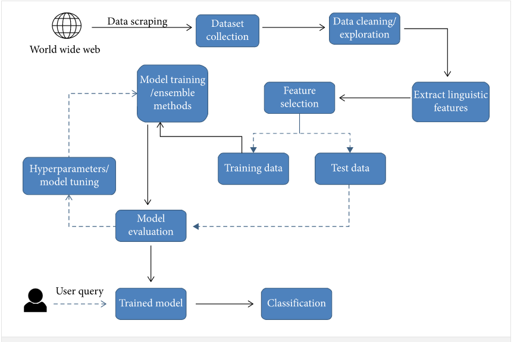

    <strong>A webapp for predicting whether the text of a news article is true or fake.</strong>

    <a href="https://fakenews-nj.herokuapp.com/">https://fakenews-nj.herokuapp.com/</a>

---

## Motivation

Fake news is a problem that emerged since the beginning of the modern information age. It provides nothing but disinformation for the people.

Even if there are companies with a large budget investing on this field, this is a personal approach for fighting this problem, since I was not able to found a useful tool for the people that read news.

## How it works?

This is a Machine Learning oriented project. The following flowchart shows the expected use the webapp has as of now.

    

This Web App is developed to prevent the spread of fake news. This app is trained using Multinomial Naive Bayes Algortihm in Machine Learning.
The data for training is scraped using Beautiful Soup from a U.S. Website, www.politifact.com. 
Backend is developed using Flask and the app is deployed on Heroku Paas.
Frontend is developed and designed using bootstrap template.
This is an End to End implementation of Multinomial Naive Bayes Algorithm with a test accuracy of 86.4%.

## Datasets

For training and testing of the model, the following Kaggle datasets were used:

- ['Fake News' InClass Prediction Competition](https://www.kaggle.com/c/fake-news/data)

- ['Fake and real news dataset' by Clément Bisaillon](https://www.kaggle.com/clmentbisaillon/fake-and-real-news-dataset)
